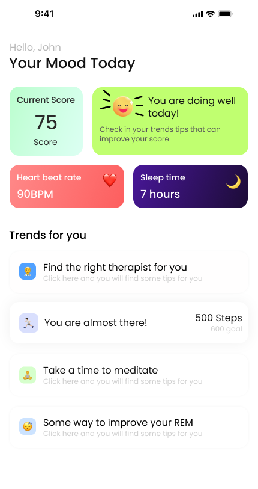

# mood_ai

A Flutter application for tracking mood and analyzing it using AI.

## Features

- Track mood and analyze it using AI

## Technologies

- Flutter
- Google Generative AI
- Google Fonts

## Getting Started

1. Clone the repository
2. Run `flutter pub get`
3. Run `flutter run`

## API Key

- Create a new API key in the Google Cloud Console
- Add the API key to the `lib/src/services/gemini_service.dart` file

## Resources

- [Flutter Hunt - UI Examples](https://flutterhunt.com/)
- [Flutter Material Widgets](https://docs.flutter.dev/ui/widgets/material)
- [Gemini AI Flutter Sample](https://github.com/google-gemini/generative-ai-dart/blob/main/samples/flutter_app/lib/main.dart)
- [Flutter Cupertino Widgets](https://docs.flutter.dev/ui/widgets/cupertino)
- [Google Gemini 101 Pathway](https://developers.google.com/learn/pathways/solution-ai-gemini-101)
- [Google AI Studio](https://aistudio.google.com/app/prompts/new_chat)
- [Gemini API Getting Started](https://ai.google.dev/gemini-api/docs/get-started/tutorial?lang=dart&hl=pt-br#set-up-project)
- [Gemini API Models Documentation](https://ai.google.dev/gemini-api/docs/models/gemini)
- [Google AI Studio API Key](https://aistudio.google.com/app/apikey)

## Challenge Description 🏆

Create a mood tracking dashboard that displays the user's current emotional state and provides personalized recommendations. The UI should be clean, modern and user-friendly.

## Figma Design

## Screenshots

## Requirements

### Must Have:

- A dashboard that displays the user's current emotional state
- A floating button to add a new mood
- Theui in the image above

## Tips

- No need to implement state management (but you can if you want)
- Use the Figma design as a reference
- AppTheme is already implemented
- Emojis are already implemented

## Evaluation Criteria

- Clean code structure
- UI accuracy compared to the design

## How to submit

- Create a new branch
- Add your LinkedIn profile
- Push your changes
- Create a pull request
- Wait for the review

## Announcement

Monday 10th, I will send a message to the best solutions and share the linkedin post.

Good luck! 🚀
Note: Feel free to use custom widgets for cards and other repeated elements to keep your code DRY (Don't Repeat Yourself).
